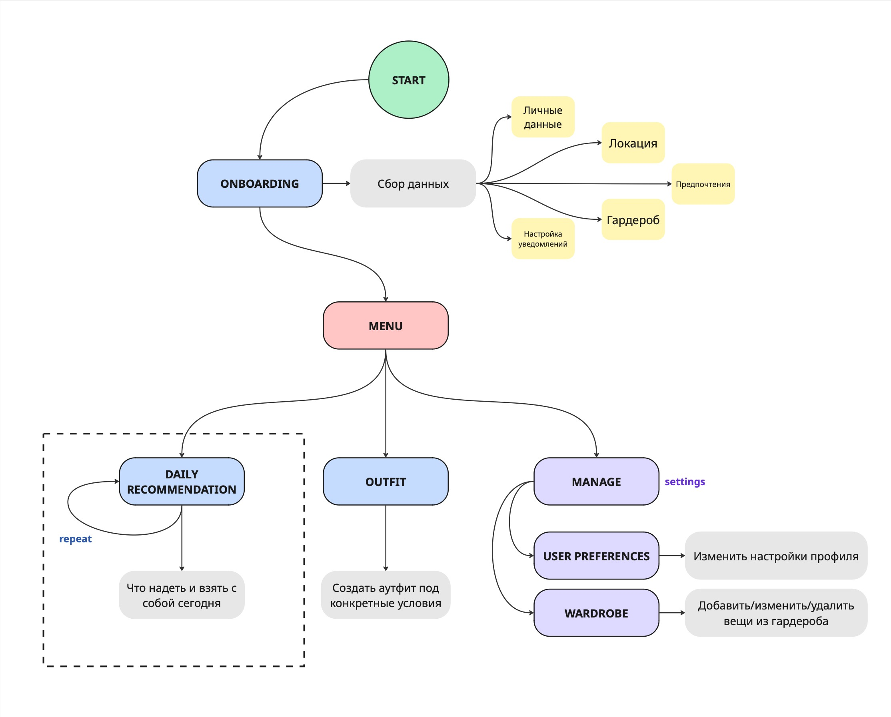
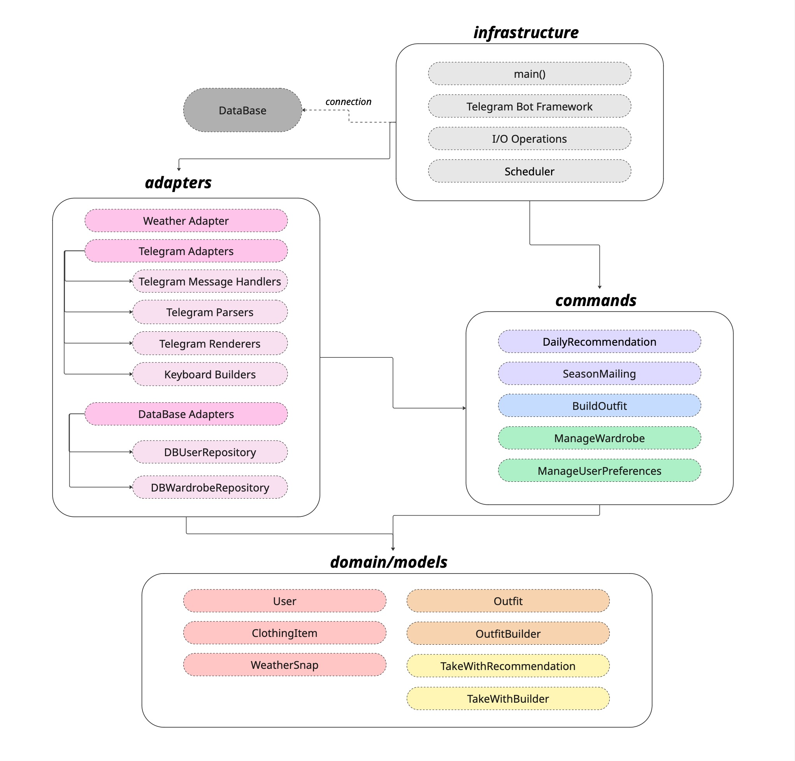

# Документация к проекту "Гардеробный" по курсу Advanced Python
## Описание 
> *Не знаете, что сегодня надеть на учебу? Накинули один худак и совсем позабыли, что пары до 19:30, и по итогу идете до метро и потихоньку превращаетесь в белого ходока?*

***ФКН носит Prada*** - это бот-стилист в мессенджере Telegram, который анализирует погоду на весь день и утром отправляет рекомендации по тому, что стоит надеть и что лучше всего взять с собой, чтобы отлично чувствовать себя в течение дня (в том числе и не замерзнуть)!

## Взаимодействие с пользователем

### Начальная настройка
При первом запуске бот проводит пользователя через короткий онбординг, в ходе которого собирает основную информацию.

Пользователь передаёт боту:
* Личные данные (пол, возраст)
* Местоположение (город или текущая точка — для получения погоды)
* Предпочтения в одежде (стиль, чувствительность к холоду/жаре)
* Гардероб (список имеющихся вещей)
* Настройки уведомлений (время получения ежедневных рекомендаций)

### Основные возможности
#### 1. Ежедневные рекомендации
* Получать автоматически собранный аутфит на день
* Узнавать, что взять с собой (зонт, SPF, шарф и т.д.)

#### 2. Подбор аутфита по запросу
Получить составленный комплект под конкретные условия:
- дату
- город
- прогноз погоды
- стиль

#### 3. Управление профилем
Пользователь может изменять:
* Гардероб
(добавлять, удалять и редактировать вещи)
* Предпочтения
(стиль, комфортная температура, местоположение и т.д.)
* Персональные данные
* Настройки уведомлений

## Архитектура проекта
 
### Infrastructure

Слой **Infrastructure** отвечает за инициализацию приложения и интеграцию с внешними системами.

#### Компоненты

- **main()** — точка входа, запуск приложения и инфраструктуры.
- **Container** — DI-контейнер для сборки use-case’ов, репозиториев и сервисов.
- **Database Connection** — управление подключением к базе данных.
- **Scheduler** — запуск фоновых задач (например, сезонных рассылок).

### Bot

Слой **Bot** отвечает за взаимодействие с пользователем через Telegram.

#### Компоненты

- **Handlers** — обработчики сообщений и callback’ов, реализующие пользовательские сценарии и FSM-логику.
- **Keyboards** — генерация inline- и reply-клавиатур для навигации и выбора действий.
- **Helpers / LoaderTgImage** — вспомогательные утилиты для загрузки изображений из Telegram.

### Adapters

Слой **Adapters** отвечает за интеграцию доменной логики с внешними системами и форматами данных.

#### Компоненты

- **Weather Adapter** — получение и преобразование погодных данных из внешнего API.
- **Telegram Adapters / Renderers** — преобразование результатов use-case’ов в Telegram-сообщения (текст, кнопки, форматирование).
- **Data Adapters** — вспомогательные адаптеры для работы с внешними данными.
  - **OutfitImageRenderer** — обработка изображений: удаление фона и сборка коллажей аутфитов.
  - **Translator** — взаимодействие с API-переводчиком.
- **Database Adapters**
  - **Repositories** — реализация интерфейсов репозиториев для работы с БД.
  - **Models** — ORM-модели и схемы хранения данных.
- **ML / MLItemRecommender** — интеграция ML-модели для оценки и рекомендаций вещей.

### Commands

Слой **Commands** содержит use-case’ы — сценарии взаимодействия пользователя с системой и бизнес-логику приложения.

#### Use-cases

- **DailyRecommendation** — формирование ежедневной рекомендации на основе погоды, гардероба и предпочтений пользователя.
- **SeasonMailing** — сезонные уведомления с определением смены сезона и защитой от повторных рассылок.
- **BuildOutfit** — подбор одного или нескольких аутфитов по дате, городу, стилю и погодным условиям.
- **ManageWardrobe** — добавление, обновление и удаление вещей в гардеробе пользователя.
- **ManageUserPreferences** — изменение пользовательских настроек (стиль, мерзливость, уведомления и т.д.).

### Domain

Слой **Domain** содержит ключевую бизнес-логику и не зависит от инфраструктуры, Telegram или внешних API.

#### Models
- **User** — пользователь и его предпочтения (стиль, мерзливость, уведомления).
- **ClothingItem** — вещь гардероба с категорией, подтипом, стилем и уровнем теплоты.
- **WeatherSnap** — погодный снимок на конкретную дату и город.
- **Outfit** — подобранный набор вещей.
- **TakeWith** — рекомендации, что взять с собой.
- **Season** — время года.

#### Services
- **OutfitBuilder** — подбор аутфитов по погоде, стилю и характеристикам пользователя.
- **TakeWithBuilder** — формирование списка рекомендаций «что взять с собой».
- **ItemRecommender** — протокол для будущей реализации MLItemRecommender
- **SeasonChangeDetector** — определение смены сезона.
- **WeatherClassifier** — классификация погоды и уровня холодности.

#### Repositories
- **UserRepository** — протокол для будущей реализации DBUserRepository
- **WardrobeRepository** — протокол для будущей реализации DBWardrobeRepository
- **WeatherRepository** — протокол для будущей реализации OpenWeatherAdapter

## Реализация проекта и основные задачи
#### 1.	Проектирование

Проработка пользовательских сценариев, логики онбординга, последовательности действий и общей структуры приложения до реализации кода.

#### 2.	Доменные модели

Реализация ключевых сущностей и доменных сервисов, реализующих бизнес-логику подбора одежды и рекомендаций.

#### 3.	Команды (Use-cases)

Реализация основных сценариев приложения, описывающих поведение системы при действиях пользователя.

#### 4.	Адаптеры

Реализация репозиториев для работы с базой данных, адаптера получения погоды и рендереров Telegram-сообщений.

#### 5.	Интеграция с Telegram

Реализация Telegram-хэндлеров на aiogram, FSM-сценариев, callback-логики и клавиатур.

#### 6.	Инфраструктура

Настройка подключения к базе данных, DI-контейнера, планировщика фоновых задач и сборка всех компонентов приложения.

#### 7.	Завершение

Покрытие логики тестами, сборка проекта в Docker.

### Роли в команде
#### Кондакова Капитолина - тимлид, ML-модель оценки вещей, инфраструктура, интеграция с Telegram
•	Спроектирована общая архитектура проекта (domain / commands / adapters / infra).

•	Спроектированы репозитории пользователей и гардероба, обеспечена работа с БД через абстракции репозиториев с возможностью подмены реализаций в тестах.

•	Интегрирована ML-модель оценки и рекомендаций вещей через MLItemRecommender. ML-модель обучена на синтезированном датасете, сформированном по правилам совместимости вещей (стиль, сезонность, уровень теплоты, погодные условия).

•	Реализованы Telegram-хендлеры на aiogram, включая FSM-сценарии, callback-логику и рендереры сообщений.

•	Реализован DI-контейнер (Container) для сборки use-case’ов, репозиториев и сервисов. Настроена работа проекта в Docker, тестовое окружение и изоляция внешних зависимостей.

#### Бузмакова Кира - обработка изображений, составление рекомендаций на день, сезонные уведомления
•	Реализованы методы обработки изображений, включая удаление фона у изображений одежды и генерацию коллажей готовых аутфитов. Используется единый пайплайн, применяемый при добавлении вещей и при формировании визуальных рекомендаций.

•	Реализован use-case DailyRecommendation, формирующий ежедневную рекомендацию на основе погодных условий, гардероба и предпочтений пользователя. В рамках use-case собираются аутфиты, погодная сводка и список вещей, которые стоит взять с собой.

•	Реализован use-case SeasonMailing с определением текущего сезона через detect_season. Добавлен механизм защиты от повторной отправки уведомлений для одного и того же сезона одному пользователю.

#### Рытова Маргарита - интеграция с погодным API, логика составления аутфитов
•	Реализован OpenWeatherAdapter для получения погодных данных по дате и городу с внешнего API. Полученные данные приводятся к единому доменному формату WeatherSnap и используются во всех ключевых use-case’ах (подбор аутфитов, ежедневные рекомендации, сезонная логика).

•	Спроектирована доменная модель ClothingItem с классификацией по категории, подтипу, стилю, цвету и уровню теплоты. Эти параметры используются при фильтрации гардероба, оценке совместимости вещей и принятии решений в логике составления аутфитов.

•	Реализован сервис OutfitBuilder, который формирует аутфиты на основе погодных условий, чувствительности пользователя к холоду, выбранного стиля и доступных вещей в гардеробе. Поддерживается генерация нескольких вариантов с заданным лимитом и отбор подходящих комбинаций.
